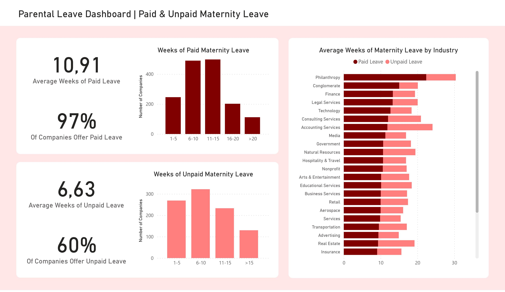

# Parental Leave Project

This is a data analytics project that involves working with a dataset obtained from [the Maven Family Leave Challenge](https://www.mavenanalytics.io/challenges/maven-family-leave-challenge/2). 
The dataset consists of a CSV table containing 1,601 records, with each record representing a different company. 
The data includes information on the company's name, industry, and crowdsourced data on the paid and unpaid weeks off they offer as part of their maternity and paternity leave policies (when available).

After uploading the dataset to a Microsoft SQL Server database, some data cleaning was performed using SQL to ensure the accuracy and relevance of the data.

The main analysis questions for this project include:
- Which industries offer the highest number of paid and unpaid parental leave weeks?
- What is the average number of parental leave weeks offered by companies?
- What percentage of companies offer parental leave?
- How many companies offer 1 to 5, 6 to 10, 11 to 15, and so on weeks of parental leave?

The insights obtained from the analysis will be communicated through clear and impactful visualizations created using Power BI.

## Data Import

The [raw dataset](./data/parental_leave_raw.csv) from Maven was saved as an Excel Worksheet and loaded into Microsoft SQL Server as the "ParentalLeave" table using the 64-bit Import and Export Wizard.

## SQL Data Cleaning

The ParentalLeave table was subjected to data cleaning using SQL to ensure the accuracy and relevance of the data in order to answer the key analysis questions.

Industry and SubIndustry were split into two columns. ([See the SQL queries used for this task](SQLqueries/SplittingIndustrySubIndustry.sql))

Added an Industry to companies that had Industry as "N/A". ([SQL queries example](SQLqueries/AddingIndustriesToN-As.sql))

To simplify the analysis of the dataset, the number of different industries was reduced by renaming or merging similar industries. The following changes were applied to the Industry names:
- Changed MOO's Industry to Business Services, MOO was in Printing Industry;
- Merged Technology, Information Services, Design, Computer & Network Security, Telecommunications, Engineering, Electronics, and Computer Software into "Technology" Industry;
- Merged Healthcare, Pharmaceutical, Pharmacies & Drug Stores, and Wellness & Fitness into "Healthcare" Industry;
- Merged Retail, Consumer Packaged Goods, and Wholesale into "Retail" Industry;
- Merged Legal Services and Law Firm into "Legal Services" Industry;
- Merged Sporting Goods, Cosmetics, Retail and Textiles into "Retail" Industry;
- Merged Transportation and Maritime into "Transportation" Industry;
- Merged Utilities and Nonprofit into "Nonprofit" Industry;
- Merged Hospitality and Leisure, Travel & Tourism into "Hospitality & Travel" Industry;
- Merged Educational Services and Publishing into "Educational Services" Industry. ([SQL queries example for these merges](SQLqueries/IndustryMerging.sql))

New columns were added to group companies based on the number of weeks of parental leave offered. Companies were categorized into groups such as 1-5 weeks, 6-10 weeks, 11-15 weeks, and so on. ([Check out these SQL queries example](SQLqueries/Grouping.sql))

## Power BI Dashboard

Utilizing Power BI, a dashboard was created by connecting to the SQL Server database and importing the [ParentalLeave table data](data/ParentalLeave.xlsx).

A range of charts and cards were created to address the primary analysis questions.

Correctly sorting the columns in the "Weeks of Paid Maternity Leave" and "Weeks of Unpaid Maternity Leave" charts involved the following steps: ([Sort a Column with a Custom Order in Power BI | Tutorial on Youtube](https://www.youtube.com/watch?v=CpBy79AawVw)) ([Link to the dataset after these changes were made](data/PBIparentalLeave.xlsx))

Measures were added to calculate the percentage of companies that offer parental leave. ([Measure example](https://github.com/GabeJRodrigues/Parental_Leave_Project/blob/main/data/%25CompaniesPaidMaternityLeave))

## To-do

Add the paternal leave page.

Add a filter panel to the top right corner.
